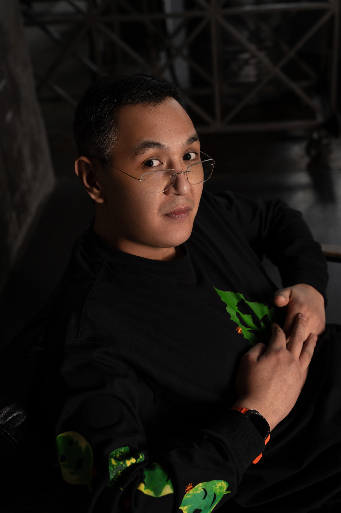

# Алиев Айдар — Data Engineer

---
> 

> <strong>Инженер данных / Аналитик данных</strong> 
> Python&nbsp;|&nbsp;SQL&nbsp;|&nbsp;Linux 
> Airflow&nbsp;|&nbsp;PostgreSQL&nbsp;|&nbsp;Pandas&nbsp;|&nbsp;PySpark&nbsp;|&nbsp;scikit-learn&nbsp;|&nbsp;Bash&nbsp;|&nbsp;R 
> Проживание:&nbsp;Москва,&nbsp;Россия
> 

---

[📥 Скачать полное резюме](CV_Aliev_data_engineer.pdf)

---

## 📌 Абстракт

- Более 14 лет опыта работы с данными
- Промышленный опыт построения ETL на Airflow + PostgreSQL для крупных проектов (ВТБ)
- Уверено владею Linux, SQL и Python, есть опыт CI/CD и контейнеризации
- Ищу развитие в **Data Engineering**, также открыт к **ML Engineering** и **Data Analytics**

---

## 📂 Проекты на GitHub

- [Jupyter ноутбуки с проектами по анализу данных, машинному и глубокому обучению](https://github.com/aydaraliev/data_science_course_yandex)
- [Проекты на PostgreSQL (сложные запросы, пользовательские типы данных, срипты и хранимые рутины на PL/pgSQL, плагины, проектирование БД, триггеры, оптимизация запросов)](https://github.com/aydaraliev/SQL_for_development_course_yandex)

---

## 🏢 Опыт работы

### Иннотех, Группа компаний
*Москва • Ноябрь 2022 — настоящее время*  
*Ведущий российский интегратор IT-решений для корпоративного сектора*  
**Разработчик ETL-процессов (Data Engineer)**

**Зона ответственности:**
- Автоматизация ETL-процессов для проекта ВТБ на стеке Airflow + PostgreSQL.
- Рефакторинг, доработка и исправление ошибок внутренних фреймворков (Python, SQL).
- Обновление, создание новых и исправление ошибок в отчётах (Airflow, PostgreSQL, YAML, xml),
- Написание инструкций для разработчиков по алгоритмам работы с внутренними фреймворками (xml).
- Создание и регистрация .jar (Scala, Spark, Maven) модулей для загрузки больших (~100-150 Gb) таблиц в staging слой DWH команды.
- Поставка всех выполненных работ до production среды в рамках CI/CD процесса (git, sfera, Liquibase, YAML).

**Ключевые достижения:**

✔ Автоматизировал обслуживание ODS слоя DWH (удаление устаревших данных), устранив необходимость в дополнительном железе (Airflow, PostgreSQL).  
✔ Разработал DAG для извлечения, трансформации и загрузки (ETL/ELT) FDW таблиц объёмом до 700 млн. строк (150 GB) в рамках DWH формирования регуляторной отчётности. Использовал PL/pgSQL процедуру которая вызывается и DAG'а Airflow.  
✔ Внедрил новый этап логирование, повысив прозрачность и удобство поддержки процессов в т.ч. командой поддержки. Модуль стал обязательным для использования всеми разработчиками команды. Спроектировал схему хранения логов, написал рутины на PL/pgSQL и триггеры а также модуль с рутинами Python для вызова из Airflow.  
✔ Написал модуль который используется в 100+ DAGах Airflow нашей команды. Отрефакторил что было, привёл к читаемому виду, применил подход DRY (вынес общие функции и константы в отдельный Python модуль).  
✔ Реализовал декоратор авторизации на Python с несколькими уровнями вложенности. Декоратор используется во всех DAG'ах нашей команды (90% отчётов). Команда занимается регуляторной отчётностью, так что это много.  

**Стек:** ETL/ELT, Python, SQL, Airflow, PostgreSQL, PL/pgSQL, Spark, git, Confluence, Maven

---

### Институт молекулярной генетики, НИЦ Курчатовский институт  
*Москва • Сентябрь 2020 — настоящее время*  
*Ведущий российский научный центр в области молекулярной генетики, осуществляющий фундаментальные и прикладные исследования данных о мутациях и биомедицинских образцах.*  
**Аналитик данных / Биоинформатик**

**Зона ответственности:**
- Обработка больших массивов биомедицинских данных (50–60 млн строк на 3–6 столбцов) в Linux-среде (Pandas, multiprocessing, bash, CLI утилиты).
- Проведение прунинга, импутации и анализа данных о мутациях с использованием Python и специализированных утилит (Python, R, специализированный FOSS софт из предметной области).
- Интеграция C/C++ инструментов (tabix, vcftools, bcftools etc.) в автоматизированные пайплайны на Python и R. 
- Автоматизация процессов выявления мутаций, связанных с риском ОНМК; автоматизация контроля качества подаваемых и получемых из пайплайна данных; подготовка аналитических отчетов (Python, R, специализированный FOSS софт из предметной области).

**Ключевые достижения:**

✔ Спроектировал и оптимизировал пайплайн для анализа генетических данных объёмом 50+ млн записей, используя Python и bash-скрипты в среде Linux (реализовал многопоточное выполнение на сервере).  
✔ Интегрировал C++ утилиты в пайплайн на Python и R, повысив производительность вычислений с ~36 часов до ~5 часов при обработке VCF-файлов объёмом до 150 GB.  
✔ Интегрировал рассчёт нескольких статистик для выявления и анализа ключевых мутаций ассоциированных с ОНМК (FOSS из предметной области).  
✔ Разработал систему автоматизированных отчетов, которые позволяют выявить ошибки первого рода при поиске ассоциаций SNP-полиморфизмов с ОНМК (bash скрипты которые склеивающие скрипты на R).  

**Стек:** Python, R, bash, Linux, tabix, Специализированные CLI-программы (vcftools, bcftools, plink2 и.т.д.), multiprocessing, FOSS

---

### Департамент здравоохранения города Москвы  
*Москва • Август 2021 — Ноябрь 2022*  
*Крупнейшая медицинская организация, управляющая цифровыми сервисами и данными здравоохранения Москвы.*  
**Аналитик данных**

**Зона ответственности:**
- Автоматизация загрузки и обработки данных из ЕМИАС и S3 облака nextcloud в локальное хранилище DWH на ClickHouse SQL, (Airflow).
- Разработка управленческих отчётов и аналитических дашбордов для подразделений департамента (Pandas, ClickHouse SQL, matplotlib, seaborn).
- Расчет метрик эффективности для медицинских учреждений (Pandas, Airflow).
- Автоматизация своевременного обновления справочников (например, прикрепление адреса к поликлинке, список закрытых на ремонт медицинских учреждений и др.).
- Выполнение ad-hoc аналитики и подготовка данных по индивидуальным запросам от сотрудников ДЗМ (Pandas, ClickHouse SQL, Excel).
- Помощь с автоматизацией рутинных задач оперативному отделу (Pandas, Airflow, openpyxl).

**Ключевые достижения:**

✔ Автоматизировал процесс извлечения, трансформации и загрузки (ETL) данных (плоские файлы до 20 Гб.) в ClickHouse, обеспечив стабильность и скорость обновлений (Airflow).  
✔ Атоматизировал формирование ежедневных отчётов по KPI и другим статистикам работы подчинённых организаций (больницы/поликлиники), освободив ~25 часов в неделю у сотрудников оперативного отдела (Pandas, Airflow, openpyxl).  
✔ Автоматизировал интеграцию и ведение справочников адресов, устранив необходимость ручной работы, удалось освободить около 5 часов времени в неделю у сотрудников аналитического отдела (Pandas).  
✔ Разработал комплексный пайплайн на Airflow + pandas + ClickHouse для контроля качества витрин данных для аналитиков оперативного отдела. Качественные витрины позволили на ~7 часов сократить время, затрачиваемое на предобработку данных.  

**Стек:** Стек: ETL/ELT, Python, SQL, ClickHouse, Airflow, pandas, openpyxl, requests, matplotlib, seaborn

---

### Работа в лабораториях, преподавание
*Москва / Новая Зеландия / Амстердам / Бишкек • Август 2011 — Сентябрь 2020*  
*Исследовательская и образовательная деятельность в международных лабораториях и вузах, включая проектирование аналитических пайплайнов и преподавание Python/аналитики данных.*  
**Биоинформатик (ETL/ELT-пайплайны, анализ данных, моделирование, преподавание)**

Зона ответственности:

- Моделирование (дифференциальные уравнения, ABM) и анализ биологических данных с использованием Python, Java, R и Bash.
- Разработка, оптимизация и поддержка аналитических пайплайнов для исследований и учебных задач (Python, Linux, Pandas, seaborn, R, scikit-learn, multiprocessing).
- Преподавание основ Python и анализа данных студентам.
- Интеграция CLI-утилит (C/C++/Fortran/R) в существующие пайплайны.

Ключевые достижения: 
✔ Смоделировал изменения в человеческом геноме при расселении людей по островам тихого океана от 50 до 20 тысяч лет назад (Massey University, New Zealand).  
✔ Обучил более 60 студентов основам Python, сформировав фундаментальные навыки у второкурсников Школы предпринимательства и управления бизнесом Американского университета Центральной Азии (г. Бишкек, Кыргызстан).  
✔ Автоматизировал обработку сложных данных с помощью CLI утилит и скриптов на bash, Python и R, снизив трудозатраты нескольких исследовательских команд в области Биоинформатики (Новая-Зеландия, 2 лаборатории в РФ).  
✔ Создал модель биореактора по переработке дихлорметана при помощи дифференциальных уравнений (Институт системной биологии, Москва, РФ).  
✔ Участвовал в международных коллаборациях, применяя современные методы статистики и визуализации данных.  

Стек: Python, Bash, R, Java, Linux, C/C++ build tools, scikit-learn, multiprocessing, FOSS

---

## 🎓 Образование

| Год  | Учебное заведение                          | Специальность и квалификация                  |
|------|-------------------------------------------|----------------------------------------------|
| 2014 | Massey University, Новая Зеландия         | Master in Computational Biology              |
| 2011 | МГУ им. М.В. Ломоносова (ФФМ)             | Лечебное дело (врач)                         |
| 2011 | МГУ им. М.В. Ломоносова (ВМиК)            | Разработчик (доп. квалификация)              |

---

## 🏅 Сертификаты

- **2024** — SQL для разработчиков (Яндекс Практикум)
- **2023** — Специалист по Data Science (Яндекс Практикум)
- **2020** — Python and Flask Bootcamp (Udemy)
- **2018** — Data Science Math Skills, Statistics with R, OOP in Java, REST APIs, Linear Algebra, Calculus (Coursera/edX/Stanford)

---

## 🛠 Навыки и стек

- **Языки:** Python, SQL, R, Java
- **Базы данных и хранилища:** PostgreSQL, ClickHouse, S3
- **ETL и Workflow:** Airflow, Cron
- **Анализ данных:** pandas, matplotlib, seaborn, scikit-learn, Jupyter
- **API и Web:** REST, Flask
- **DevOps:** git, Docker, CI/CD
- **ОС:** Linux (Ubuntu, Tuxedo OS)

---

## 💬 О себе

- Учился программировать на ВМиК МГУ параллельно с дипломом врача (ФФМ МГУ).
- После выпуска занимался сначала биоинформатикой, затем полностью перешёл в ETL и Data Engineering.
- Уверенно знаю Python и SQL и стремлюсь углубить свои знания.
- Имею 3 года промышленного опыта разработки ETL процессов.
- Сторонник непрерывного обучения. Сейчас прохожу курс по инженерии данных на Яндекс Практикум.
- Интересуюсь достижениями искусственного интеллекта (и Data Science как отрасли), посещал лекции и семинары по теории игр вместе с магистрами в университете Амстердама в течение семестра.
- Всю карьеру так или иначе работал со структурированными (табличными) данными.
- Преподавал Python и основы анализа данных студентам.
- Уверенно работаю в Linux, люблю автоматизацию процессов.
- Открыт к предложениям Data Engineer, ML Engineer и Data Analyst.

---

## 📲 Telegram

---

[📥 Скачать полное резюме](CV_Aliev_data_engineer.pdf)

---